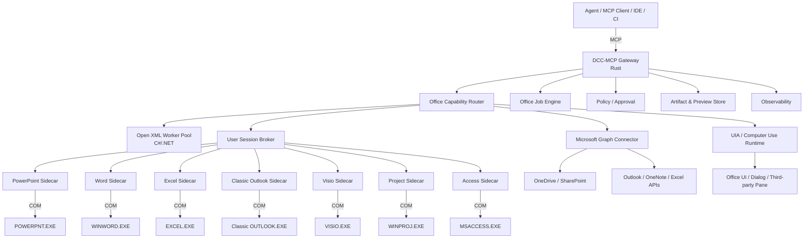
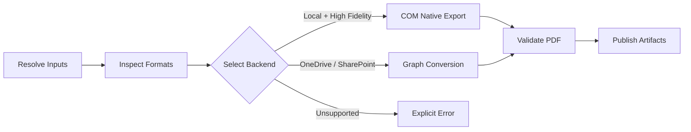
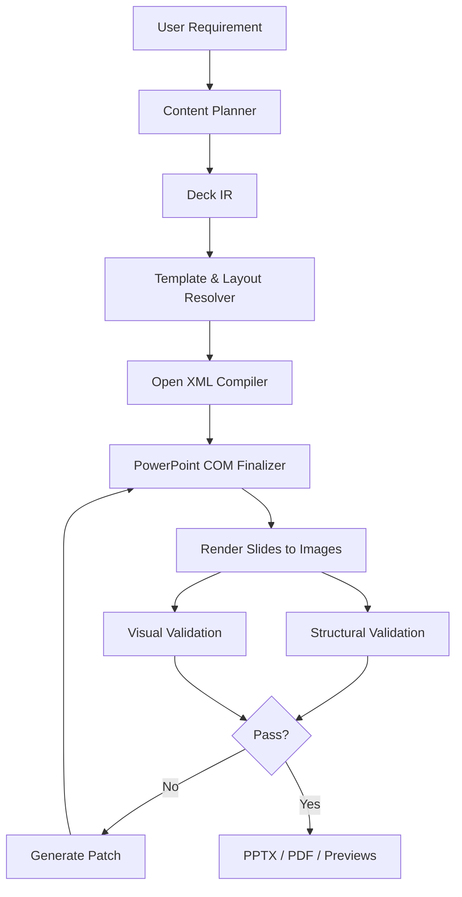

# DCC‑MCP Office Automation Platform 架构方案

> 文档版本：1.0  
> 状态：Proposed Architecture  
> 更新日期：2026‑08‑16  
> 适用项目：DCC‑MCP  
> 目标平台：Windows 桌面 Office、Microsoft 365、OneDrive、SharePoint  
> 核心技术：Rust、C#/.NET、COM、Open XML、Microsoft Graph、Office.js、Windows UI Automation、Computer Use

---

## 0. 文档定位

本文定义 DCC‑MCP 对 Microsoft Office 全家桶的统一接入方案，使 Agent 能够可靠地：

- 批量将 PPT、Word、Excel 等文件转换为 PDF；
- 批量检索与替换文字、Logo、页眉页脚、备注、批注和元数据；
- 从零生成 PowerPoint、Word、Excel 等 Office 文档；
- 操作当前已打开的文档、当前页面、当前选区和当前单元格；
- 使用 Office 原生渲染、排版、公式计算和导出能力；
- 在 COM 无法覆盖时降级到 Office.js、UI Automation 或视觉 Computer Use；
- 将 Maya、Houdini、Blender、Unreal、Photoshop 等 DCC 产物自动编排成评审 PPT、技术报告和数据表。

本文不是“把全部 COM API 包装成 MCP Tool”的方案，而是一个面向 Agent 的、任务级、可验证、可扩展的 Office 自动化平台。

---

## 1. 架构结论

推荐采用以下组合：

```text
Rust dcc-mcp-server
        +
DCC-MCP Office Adapter / Skill Pack
        +
C# Office Desktop Runtime
        +
每个 Office 应用独立 COM Sidecar 进程
        +
Open XML Worker Pool
        +
Microsoft Graph Connector
        +
可选 Office.js Add-in
        +
Windows UI Automation / Computer Use 兜底
```

核心原则：

1. **Rust 负责控制面，C# 负责 Office COM 数据面。**
2. **每个 Office 应用独立进程，但共享同一套 C# Runtime。**
3. **批量静态文件处理优先 Open XML，最终高保真渲染优先 Office COM。**
4. **云文件、Outlook、OneNote 和 Excel Online 能力优先 Microsoft Graph。**
5. **Agent 只看到任务级 Capability，不直接看到原始 COM 方法。**
6. **所有复杂写入都必须具备检查点、验证、预览和可追踪结果。**
7. **DCC‑MCP 与 SUA 应共享 Office 自动化核心，不维护两套 COM 实现。**

---

## 2. 目标与非目标

### 2.1 目标

- 为 Office 家族建立统一的 Capability、Job、Artifact、Session、Permission 和 Error 模型。
- 支持 PowerPoint、Word、Excel 的首批生产能力。
- 后续扩展 Outlook、OneNote、Visio、Project 和 Access。
- 支持本地交互式 Office、关闭状态文件、OneDrive/SharePoint 云文件三种主要场景。
- 支持 Agent 从需求到文档规划、生成、渲染、检查、修复和导出的闭环。
- 与 DCC‑MCP 的 `search → load/describe → call` 渐进式发现机制兼容。
- 将 Office 作为 DCC 生产流程的交付与评审终端，而不是孤立的办公自动化模块。

### 2.2 非目标

- 不承诺通过单一 API 覆盖 Office UI 的每一个按钮。
- 不把 Windows Service Session 0 中直接启动 Office 作为默认方案。
- 不向 Agent 暴露任意 VBA、任意 `Application.Run` 或任意 `ExecuteMso`。
- 不把 Word、Excel、PowerPoint、Visio 的文档语义强行压成同一种通用节点。
- 不以 VSTO 插件承载核心自动化逻辑。
- 不把 Open XML 当作 Office 原生排版或 PDF 渲染引擎。
- 不以截图点击作为结构化 API 的替代方案。

---

## 3. 设计原则

### 3.1 Native-first，Computer Use 最后兜底

固定优先级：

```text
结构化 Package API / Cloud API / Native COM
                  ↓
              Office.js
                  ↓
       Windows UI Automation
                  ↓
      Vision Computer Use / CUA
```

对于同一个动作，路由器应优先选择确定性更高、可验证性更强的执行方式。

示例：

```text
替换关闭状态 PPTX 中的普通文本
    → Open XML

修改当前 PowerPoint 选中的 Shape
    → PowerPoint COM

读取 OneDrive 上 Excel 表格并写入数据
    → Microsoft Graph Workbook API

触发没有公开对象模型的内置 Ribbon 命令
    → 白名单 ExecuteMso

操作 Designer、Copilot 或第三方自绘任务窗格
    → UIA，必要时视觉 Computer Use
```

### 3.2 任务级能力，不暴露原始对象模型

Agent 不应直接操作：

```text
PowerPoint.Shape.TextFrame.TextRange.Text
Word.Range.InsertAfter
Excel.Range.Value2
```

DCC‑MCP 应暴露：

```text
office.batch.replace_text
office.batch.convert
office.document.generate
office.document.patch
office.document.render
office.document.validate
powerpoint.deck.generate
powerpoint.slide.compose
word.document.reflow
excel.workbook.calculate
```

这样可以：

- 降低 MCP Schema 规模；
- 避免 Office 版本差异泄漏给 Agent；
- 在 COM、Open XML、Graph 之间切换；
- 将权限、验证、重试和审计统一放在 Gateway；
- 减少大量低级 COM 往返。

### 3.3 共享 Runtime，应用级语义独立

共享：

- RPC；
- Sidecar 生命周期；
- STA 调度；
- COM 重试；
- Job；
- Artifact；
- Permission；
- Telemetry；
- Error；
- Revision；
- Validation。

不共享或不强行统一：

- PowerPoint Slide/Shape/Animation；
- Word Section/Paragraph/Content Control；
- Excel Worksheet/Table/Range/Formula；
- Visio Page/Shape/Connector/ShapeSheet；
- Project Task/Resource/Assignment；
- Access Table/Query/Form/Report。

---

## 4. 总体架构



---

## 5. 与 SUA 的代码共享边界

两份产品文档不代表两套实现。推荐抽取中立的 Office 自动化核心：

```text
office-automation-core/
├── office-protocol
├── office-ir
├── office-openxml
├── office-desktop-runtime
├── office-graph
├── office-validation
└── office-testkit
```

DCC‑MCP 只增加：

```text
dcc-mcp-office/
├── MCP tool schemas
├── capability discovery
├── DCC workflows
├── DCC artifact integration
└── DCC-MCP lifecycle adapter
```

SUA 增加：

```text
sua-office-pack/
├── software profiles
├── provider manifests
├── generic action bindings
├── observation/verification bindings
└── fallback policy
```

禁止形成：

```text
DCC-MCP Office COM implementation
        +
SUA Office COM implementation
```

推荐形成：

```text
Shared Office Runtime
      ↙           ↘
DCC-MCP Adapter   SUA Capability Pack
```

---

## 6. 五类执行后端

### 6.1 Open XML Package Backend

适用：

- DOCX、XLSX、PPTX 文件未打开；
- 批量静态读取和修改；
- 从模板生成文档；
- 批量替换普通文本；
- 修改文档属性、样式、表格和占位符；
- 大量文件并行处理；
- 无 Office 安装环境下的结构处理。

Open XML SDK 可创建和修改 Word、Excel、PowerPoint 的 Open XML Package。[MS‑02][MS‑03]

不适合直接承担：

- Word 最终分页；
- PowerPoint 最终画面；
- Excel 原生公式重算；
- 高保真 PDF；
- PowerPoint 动画实际播放；
- Office 字体替换后的视觉结果。

因此它是**结构编译器和批处理引擎**，不是 Office 渲染器。

### 6.2 Desktop COM Backend

适用：

- 当前已打开文档；
- 当前选区与窗口状态；
- Office 原生布局、计算、渲染和导出；
- PowerPoint 母版、动画、转场、放映；
- Word 字段、目录、分页、修订；
- Excel 公式、图表、数据透视表、计算链；
- Visio ShapeSheet、Stencil、连接线和布局；
- Project 任务、资源和进度；
- Access 表单、报表和应用行为。

Word、PowerPoint、Excel、Outlook、Visio、Project 和 Access 都有各自的桌面对象模型。[MS‑11]—[MS‑18]

### 6.3 Microsoft Graph Backend

适用：

- OneDrive、SharePoint 文件；
- 云端上传、下载和权限；
- 受支持文件到 PDF 的转换；
- Outlook 邮件、日历、联系人；
- OneNote；
- Excel Workbook API；
- 无本地 Office 安装的云工作流。

Graph 的文件格式转换不是任意格式之间的任意转换，调用前必须查询或维护支持矩阵。[MS‑05]

Excel Graph 多调用工作流应建立 Workbook Session，以提高性能并统一持久化行为。[MS‑06][MS‑07]

### 6.4 Office.js Context Backend

适用：

- Office 内 Task Pane；
- Ribbon 按钮；
- 当前选区上下文；
- Windows、Mac、Web 间的跨平台界面；
- 新 Outlook；
- 用户确认和 Agent 状态展示。

Office Add-ins 基于 HTML、CSS、JavaScript，并在浏览器或 WebView 沙箱中运行；其跨平台能力优于 COM/VSTO。[MS‑04][MS‑19]

它不替代桌面 COM 的深度能力，而是负责**上下文、UI 和跨平台入口**。

### 6.5 UIA / Computer Use Backend

适用：

- COM/Office.js 没有公开对象模型的 UI；
- Designer、Copilot 等任务窗格；
- 第三方插件；
- 文件选择器和特殊系统对话框；
- 自绘 UI。

原则：

- UIA 优先于纯视觉坐标点击；
- 操作前读取控件树和窗口状态；
- 操作后必须验证 UI 状态或文档状态；
- 写操作不得静默从结构化 API 降级到视觉操作；
- 高风险 UI 操作必须请求确认。

---

## 7. 应用支持矩阵

| 应用 | 首选结构后端 | 桌面深度后端 | 云/跨平台后端 | 建议阶段 |
|---|---|---|---|---|
| PowerPoint | Open XML | COM | Office.js、Graph 文件转换 | P0 |
| Word | Open XML | COM | Office.js、Graph 文件转换 | P0 |
| Excel | Open XML | COM | Graph Workbook、Office.js、Office Scripts | P0 |
| Classic Outlook | MSG/附件辅助解析 | Outlook Object Model / COM | Graph、Office.js | P1 |
| New Outlook | 不作为本地主路径 | 不支持 COM/VSTO | Graph、Outlook Web Add-in | P1 |
| OneNote | 不作为本地主路径 | 不列入首期 COM | Graph、Office.js | P1 |
| Visio | VSDX 辅助处理 | COM | Visio JavaScript API | P1 |
| Project | 文件辅助能力 | COM | Office Add-in 通用能力 | P2 |
| Access | Access Database Engine | COM | 无统一 Office.js 主路径 | P2 |
| Publisher | 仅归档和迁移 | 旧 COM 仅兼容 | 无长期投入 | Migration |

新 Outlook for Windows 不支持 COM 和 VSTO，应明确拆成 `outlook.classic.desktop` 与 `outlook.cloud/web` 两套 Provider。[MS‑08][MS‑09]

Publisher 在 2026 年 10 月进入退役节点，DCC‑MCP 不应为它投入完整的新编辑器，只保留批量导出、归档和迁移能力。[MS‑10]

---

## 8. Windows 进程与用户会话模型

### 8.1 禁止 Session 0 直接 COM 自动化

Microsoft 不建议也不支持从 NT Service、ASP.NET、DCOM 等非交互式环境直接自动化桌面 Office，原因包括用户配置、交互式桌面、单线程 UI、对话框和死锁风险。[MS‑01]

推荐：

```text
dcc-mcp-gateway-service.exe        Machine / Session 0，可选
              │
              │ secure local IPC
              ▼
dcc-mcp-user-agent.exe             当前登录用户 Session
              │
              ├── office-host --app=powerpoint
              ├── office-host --app=word
              ├── office-host --app=excel
              └── computer-use-runtime
```

若 Gateway 本身就是当前用户进程，可直接由 Gateway 启动 User Agent 或 Sidecar。

### 8.2 每个应用独立 Sidecar 进程

推荐逻辑进程：

```text
office-host.exe --app=powerpoint
office-host.exe --app=word
office-host.exe --app=excel
office-host.exe --app=outlook-classic
office-host.exe --app=visio
office-host.exe --app=project
office-host.exe --app=access
```

可以使用同一个物理二进制，但必须保持进程隔离。

理由：

- 一个 Word 模态框不能阻塞 Excel；
- Excel 大计算不能阻塞 PowerPoint；
- 每个应用拥有独立 STA 和消息循环；
- 单应用崩溃可独立恢复；
- 兼容测试和版本探测可按应用进行；
- 日志、权限、健康状态更清晰。

### 8.3 Sidecar 生命周期

```text
requested
  → launching
  → handshaking
  → attaching | creating_application
  → ready
  → busy
  → degraded
  → recovering
  → stopped
```

Sidecar 必须提供：

- 启动握手；
- Capability Manifest；
- Office 版本、位数、语言和进程信息；
- Heartbeat；
- 当前连接文档；
- Busy/Modal/Protected View 状态；
- Graceful Shutdown；
- 崩溃后重新连接；
- 孤儿 Office 进程识别，但不得默认强杀用户启动的 Office。

---

## 9. C# Office Desktop Runtime

### 9.1 技术选择

- 使用现代 .NET Windows LTS 构建独立 EXE；
- 可发布 self-contained；
- 通过 Office Primary Interop Assemblies 或类型库生成的 Interop 使用 COM；
- 对版本可选成员允许局部使用 `dynamic` 或反射式 Capability Probe；
- 不依赖 VSTO 承载核心逻辑；
- 可选 VSTO 仅作为薄 UI Bridge。

VSTO 仍依赖 .NET Framework，微软不会将 VSTO/传统 COM Add-in 平台迁移到 .NET 5+；因此不应作为新核心 Runtime。[MS‑20][MS‑21]

### 9.2 STA 调度器

每个 Sidecar 内部：

```text
Named Pipe I/O
      ↓
Request Queue
      ↓
Single STA Dispatcher
      ↓
Office COM
      ↕
Windows Message Pump / Office Events
```

COM STA 每个线程必须初始化 COM，并运行消息循环处理跨 Apartment 调用和事件。[MS‑22]

必须实现：

- 单写队列；
- 有限读合并；
- Message Pump；
- `IOleMessageFilter`；
- `RPC_E_CALL_REJECTED` 退避重试；
- 请求软超时；
- Sidecar 级硬超时与恢复；
- 取消令牌只在安全边界生效；
- 不在任意中间状态强行中断 COM 调用。

### 9.3 COM 对象生命周期

规则：

- COM 对象绝不跨进程；
- 不长期缓存大量 `Range`、`Shape`、`TextRange` 等叶子对象；
- 缓存稳定文档句柄和应用级对象即可；
- 每次请求通过稳定 ID 重新解析对象；
- 不对共享 Application RCW 随意调用 `FinalReleaseComObject`；
- 请求边界释放短生命周期引用；
- Sidecar 进程退出作为最终隔离和清理手段；
- 事件回调中尽快复制为普通 DTO，不把 COM 引用放入异步队列。

### 9.4 多实例发现

需要实现：

```text
OfficeInstanceResolver
├── enumerate Running Object Table
├── map application HWND → process id
├── enumerate open documents
├── match by canonical path / document id
├── attach to selected instance
└── create new instance when policy allows
```

Excel、Word 等可能出现多个进程或实例，不能只依赖单个全局 `GetActiveObject`。

---

## 10. DCC‑MCP 集成模型

### 10.1 Office 作为动态 Plugin/Resource

推荐插件：

```text
office.core
office.openxml
office.desktop
office.graph
office.powerpoint
office.word
office.excel
office.outlook
office.visio
office.project
office.access
office.workflows
```

插件生命周期：

```text
install
  → activate
  → register capabilities
  → start providers
  → attach resources
  → serve requests
  → dispose/reload
```

所有注册应通过可逆 Disposable 完成，便于热加载、版本切换和进程恢复。

### 10.2 渐进式发现

保持 DCC‑MCP 既有模式：

```text
list
  → search
  → load_skill / describe
  → call
```

示例：

```text
search("批量把 PPT 转为 PDF")
  → office.batch.convert

describe("office.batch.convert")
  → 获取输入、输出、确认级别、后端要求和限制

call(...)
  → Job ID + 进度 + Artifact
```

不要在 Agent 初始上下文一次性加载数百个 Office Tool。

### 10.3 Capability Manifest

```json
{
  "provider": "office.powerpoint.desktop",
  "provider_version": "1.0.0",
  "protocol_version": "office-rpc/1",
  "application": {
    "name": "PowerPoint",
    "version": "16.0",
    "bitness": "x64",
    "language": "zh-CN"
  },
  "execution_modes": [
    "interactive-desktop",
    "existing-document",
    "native-render"
  ],
  "capabilities": {
    "presentation.inspect": "1.0",
    "presentation.patch": "1.0",
    "slide.render": "1.0",
    "document.export.pdf": "1.0",
    "animation.edit": "0.1"
  },
  "limits": {
    "max_parallel_writes": 1,
    "requires_user_session": true
  }
}
```

---

## 11. MCP Tool 与 Skill 设计

### 11.1 通用 Tools

```text
office.capabilities.search
office.application.list
office.session.attach
office.document.inspect
office.document.generate
office.document.patch
office.document.render
office.document.validate
office.document.export
office.batch.convert
office.batch.replace_text
office.batch.apply_template
office.job.get
office.job.cancel
```

### 11.2 应用特定 Tools

```text
powerpoint.deck.generate
powerpoint.slide.compose
powerpoint.slide.render
powerpoint.animation.apply
powerpoint.slideshow.control

word.document.reflow
word.fields.update
word.toc.rebuild
word.track_changes.inspect

excel.workbook.calculate
excel.table.update
excel.chart.generate
excel.pivot.refresh

outlook.message.create_draft
outlook.calendar.prepare_event

visio.diagram.layout
visio.diagram.connect

project.plan.generate
project.resources.assign

access.query.execute
access.report.export
```

### 11.3 Workflow Skills

推荐将稳定流程固化为 Skill，而不是每次让 Agent临时拼装：

```text
office.batch-to-pdf
office.global-text-replace
office.brand-template-migration
office.document-redaction
office.generate-executive-deck
office.generate-technical-report
office.generate-production-dashboard
dcc.review-deck-from-renders
dcc.asset-comparison-deck
dcc.performance-report
dcc.release-notes-document
```

Skill 应定义：

- 输入契约；
- 规划步骤；
- Provider 选择；
- 安全确认；
- 验证规则；
- 失败补偿；
- 产物命名；
- Agent 可见摘要。

---

## 12. 内部 IPC 协议

### 12.1 传输

初版推荐：

```text
JSON-RPC 2.0
over
Windows Named Pipe
```

管道命名：

```text
\\.\pipe\dcc-mcp-office-{app}-{user_sid}-{session_id}
```

要求：

- 按当前用户 SID 配置 ACL；
- 不监听公网端口；
- Gateway 是唯一远程入口；
- 支持双向 Notification；
- 支持协议版本协商；
- 大文件不使用 Base64 内嵌；
- Artifact 通过受控路径或 Artifact ID 传递。

性能证明 JSON 成为瓶颈后，才考虑 framed MessagePack；业务协议语义保持不变。

### 12.2 握手

```json
{
  "jsonrpc": "2.0",
  "id": "hello-1",
  "method": "office.host.handshake",
  "params": {
    "protocol_versions": ["office-rpc/1"],
    "gateway_version": "1.0.0",
    "requested_app": "powerpoint"
  }
}
```

响应：

```json
{
  "jsonrpc": "2.0",
  "id": "hello-1",
  "result": {
    "protocol_version": "office-rpc/1",
    "host_id": "office-host:powerpoint:session-3",
    "capability_manifest": {}
  }
}
```

### 12.3 命令

```json
{
  "jsonrpc": "2.0",
  "id": "req-1024",
  "method": "office.command.execute",
  "params": {
    "capability": "presentation.patch",
    "document": {
      "document_id": "ppt:87f1",
      "expected_revision": 18
    },
    "input": {
      "operations": []
    },
    "policy": {
      "checkpoint": true,
      "render_after": true
    }
  }
}
```

> M1 implementation note: the catalog-referenced
> `schemas/command-params.schema.json` is authoritative for the current wire
> envelope. Current capabilities use the catalog wire names, require
> the process-bound `--workspace-root` to contain every path (a request may
> echo but cannot replace that root), and carry structured `confirmation`
> evidence for confirm-gated writes. The `presentation.patch` example above
> remains a target capability.

### 12.4 进度与事件

> M1 implementation note: `batch.convert` and `batch.replace_text` return a
> process-local `job_id` immediately. `office.job.get` returns the current
> snapshot and terminal command result; `office.job.cancel` is cooperative at
> per-file safety boundaries. The named-pipe client buffers notifications that
> arrive before a matching response. `office.host.ping` is side-effect-free and
> never attaches to or starts Office.

```json
{
  "jsonrpc": "2.0",
  "method": "office.job.progress",
  "params": {
    "job_id": "job:23a8",
    "stage": "rendering",
    "completed": 16,
    "total": 40
  }
}
```

```json
{
  "jsonrpc": "2.0",
  "method": "office.event.selection_changed",
  "params": {
    "document_id": "ppt:87f1",
    "revision": 19,
    "selection": {
      "slide_id": 274,
      "object_ids": ["shape:title"]
    }
  }
}
```

---

## 13. Office Document IR

### 13.1 通用 Envelope

```json
{
  "schema_version": "office-ir/1.0",
  "kind": "presentation",
  "document_id": "draft:review-deck",
  "metadata": {
    "title": "DCC-MCP Production Review",
    "author": "DCC-MCP Agent",
    "language": "zh-CN"
  },
  "template": {
    "uri": "brand://studio/review-v3",
    "version": "3.0.0"
  },
  "resources": [],
  "document": {},
  "validation": [
    "package_valid",
    "no_missing_fonts",
    "no_text_overflow",
    "no_out_of_bounds"
  ],
  "outputs": [
    "pptx",
    "pdf",
    "slide-previews"
  ]
}
```

通用层统一：

- Document ID；
- Template；
- Resource；
- Revision；
- Patch；
- Validation；
- Artifact；
- Output；
- Provenance。

`document` 必须使用应用专属 Schema。

### 13.2 PowerPoint IR

```text
Presentation
├── theme
├── masters / layouts
├── slides
│   ├── semantic_layout
│   ├── title
│   ├── content_blocks
│   ├── images / media
│   ├── charts / tables
│   ├── speaker_notes
│   └── animation_timeline
└── export_policy
```

### 13.3 Word IR

```text
WordDocument
├── styles
├── sections
├── paragraphs
├── lists
├── tables
├── figures / captions
├── content_controls
├── headers / footers
├── fields / TOC
└── review_policy
```

### 13.4 Excel IR

```text
Workbook
├── worksheets
├── tables
├── named_ranges
├── formulas
├── validations
├── conditional_formats
├── charts
├── pivots
└── calculation_policy
```

### 13.5 Visio、Project、Access

后续分别定义：

```text
visio-ir/1
project-ir/1
access-ir/1
```

禁止为追求“统一”而丢失各自领域语义。

---

## 14. 稳定对象标识与并发控制

### 14.1 PowerPoint

- Presentation：自定义属性或 Tags 中写入 UUID；
- Slide：使用原生 `SlideID`；
- Shape：使用 Shape Tags 写入 DCC‑MCP ID；
- 索引仅作显示，不作为持久标识。

### 14.2 Word

优先选择：

- Content Control Tag；
- Bookmark；
- Custom XML 映射；
- 文档自定义属性；
- 范围 Hash + 上下文作为临时选择器。

不要长期依赖第 N 个 Paragraph 或字符位置。

### 14.3 Excel

优先选择：

- Worksheet CodeName/稳定内部 ID；
- Table Name；
- Named Range；
- Structured Reference；
- Cell Address 只作为明确网格操作的选择器。

### 14.4 Visio、Project、Access

- Visio：Page/Shape 原生 ID + Shape Data；
- Project：Task/Resource UniqueID；
- Access：对象名、查询名、表主键和报表名。

### 14.5 Revision

每个写操作携带：

```json
{
  "document_id": "ppt:87f1",
  "expected_revision": 18
}
```

若用户在 Agent 操作期间修改文档：

```text
expected_revision != current_revision
    → OFFICE_DOCUMENT_CONFLICT
```

不得静默覆盖。可由 Agent重新 inspect、合并 Patch 或请求用户确认。

M1 尚未维护稳定 revision。为保持契约诚实，任何携带 `document` /
`expected_revision` 的请求都会返回 `OFFICE_CAPABILITY_UNSUPPORTED`，直到
Host 能读取、比较并返回真实 revision；绝不接受后忽略该 guard。

---

## 15. 核心工作流

### 15.1 批量转 PDF



MCP 输入示例：

```json
{
  "inputs": {
    "glob": "D:/projects/**/*.{pptx,docx,xlsx}"
  },
  "target_format": "pdf",
  "backend": "auto",
  "output": {
    "directory": "D:/exports/pdf",
    "mode": "mirror_tree",
    "overwrite": "versioned"
  },
  "validation": [
    "output_openable",
    "non_empty",
    "page_count_reasonable"
  ]
}
```

路由策略：

- 本地、安装 Office、要求高保真：COM 原生导出；
- OneDrive/SharePoint：Graph 转换；
- Open XML：只负责预检、元数据和结构，不声称能原生生成 PDF；
- 不支持格式：返回明确原因，不静默使用低保真替代。

### 15.2 批量替换文字

执行前默认 `dry_run=true`：

```json
{
  "inputs": {
    "glob": "D:/reports/**/*.{pptx,docx,xlsx}"
  },
  "rules": [
    {
      "find": "2025年度",
      "replace": "2026年度",
      "match": "literal"
    },
    {
      "find": "Old Project Name",
      "replace": "DCC-MCP",
      "match": "case_insensitive"
    }
  ],
  "scope": [
    "body",
    "headers",
    "footers",
    "notes",
    "comments",
    "charts"
  ],
  "dry_run": true
}
```

Dry-run 返回：

- 匹配文件数；
- 总匹配数；
- 每文件变更摘要；
- 无法安全修改的对象；
- 预计使用的 Backend；
- 是否需要用户确认。

实现注意：

- Word 文本可能跨多个 Run；
- PowerPoint 文本可能在 TextFrame、表格、SmartArt、备注或图表中；
- Excel 文字可能位于单元格、公式、图表标题、批注或 Shared String；
- 不能对压缩包 XML 做不分语义的全局字符串替换；
- 特殊对象需要 COM 二次处理。

### 15.3 从零生成 PowerPoint



步骤：

1. 生成内容大纲和每页意图；
2. 选择品牌模板；
3. 按语义选择 Layout；
4. 生成 PowerPoint IR；
5. Open XML 快速构建基础 PPTX；
6. COM 打开并完成原生对象、动画和版式；
7. 导出每页预览；
8. 检查越界、溢出、缺失字体、遮挡、对齐和可读性；
9. Agent 生成 Patch；
10. 重新渲染；
11. 输出 PPTX、PDF 和预览。

### 15.4 模板优先，而不是自由坐标绘制

建立 Template Registry：

```text
brand://studio/review-v3
brand://dcc-mcp/product-launch-v2
brand://internal/technical-report-v1
```

导入模板时提取：

- Theme Colors；
- Theme Fonts；
- Masters；
- Layouts；
- Placeholder；
- Logo 安全区；
- 标题层级；
- 图表样式；
- 页边距和比例。

布局增加语义标签：

```text
title_cover
section_cover
two_columns
image_left_text_right
comparison
timeline
kpi_dashboard
full_bleed_image
technical_architecture
```

Agent 选择 `technical_architecture`，而不是直接猜测所有坐标。

### 15.5 Word 生成

推荐：

```text
Requirement
  → Document Outline
  → Word IR
  → DOCX Template + Open XML
  → Word COM update fields / TOC / layout
  → PDF render
  → page-level validation
```

重点：

- 使用 Word Styles，而不是逐段硬编码字体；
- 使用 Content Controls 作为稳定锚点；
- 页眉页脚、分节、目录、题注和交叉引用必须建模；
- 最终分页只能以 Word 原生渲染结果为准。

### 15.6 Excel 生成

推荐：

```text
Data Contract
  → Workbook IR
  → Open XML base workbook
  → Excel COM or Graph session
  → calculate / refresh / chart render
  → formula & data validation
  → XLSX / PDF / preview
```

重点：

- 先定义数据 Schema 和 Named Range；
- 区分数据、公式和展示层；
- 设置 Calculation Policy；
- 验证公式错误、空值和类型；
- 图表与 Pivot 刷新由 Excel 原生能力完成。

### 15.7 DCC 生产评审 Deck

典型 Skill：

```text
dcc.review-deck-from-renders
```

输入：

- Maya/Houdini/Blender/Unreal 渲染；
- Shot/Asset 元数据；
- 版本号；
- 制作人；
- 日期；
- 性能数据；
- 评审批注。

输出：

- 标题页；
- Shot/Asset 分组；
- 新旧版本对比；
- 图片或视频；
- 版本信息；
- 备注页；
- PDF；
- 每页预览；
- Artifact 到源 DCC 资产的反向链接。

---

## 16. Job Engine

批量操作必须是 Job，不应让一个 MCP 请求长时间占用连接。

> M1 implementation note: `office-host` contains a bounded in-memory tracker
> with one serialized Office worker, per-item progress, polling, and
> cancellation. Its active wire phases are `queued → running → terminal`;
> planning/approval/validation/publishing and durable restart recovery remain
> the `dcc-mcp-job` integration layer once that crate is published.

Job 状态：

```text
queued
  → planning
  → waiting_for_approval
  → running
  → validating
  → publishing
  → succeeded | partially_succeeded | failed | cancelled
```

Job 必须记录：

- 输入快照；
- Capability 与 Provider；
- 版本；
- 文件 Hash；
- 每项执行结果；
- 变更摘要；
- 警告；
- 产物；
- 审计记录；
- 可恢复检查点。

并发模型：

- Open XML Worker：可多文件并行；
- Graph Worker：受限流和 Session 管理约束，可并行；
- 每个 Office COM Sidecar：单 STA 写队列；
- 不同应用 Sidecar：可并行；
- 同一文档写入：默认互斥。

---

## 17. Artifact 与预览

所有输出统一注册为 Artifact：

```json
{
  "artifact_id": "artifact:2fe1",
  "kind": "application/pdf",
  "path": "D:/exports/review-v12.pdf",
  "sha256": "...",
  "source_document_id": "ppt:87f1",
  "revision": 21,
  "created_by_job": "job:23a8"
}
```

Artifact 类型：

- 原始 Office 文件；
- 变更后 Office 文件；
- PDF；
- 每页 PNG；
- 缩略图；
- 差异报告；
- JSON 检查报告；
- 日志和诊断包。

Agent 不应仅收到“成功”，而应收到：

- 做了什么；
- 哪些文件成功；
- 哪些失败；
- 哪些存在警告；
- 输出在哪里；
- 预览和验证结果；
- 是否需要人工复核。

---

## 18. 结构验证与视觉验证

### 18.1 结构验证

通用：

- Package 可打开；
- 文件扩展名与内容一致；
- Relationship 无断裂；
- 外部链接清单；
- 宏和 ActiveX 清单；
- 字体清单；
- 嵌入对象清单。

PowerPoint：

- Shape 越界；
- 文本溢出；
- 占位符缺失；
- 页面尺寸；
- 未解析媒体；
- 对象遮挡候选。

Word：

- 分节错误；
- 空白页异常；
- TOC/Field 未更新；
- 题注与引用断裂；
- 页眉页脚不一致。

Excel：

- 公式错误；
- Named Range 断裂；
- 数据类型错误；
- Pivot/Query 未刷新；
- 隐藏错误；
- 外部连接。

### 18.2 视觉验证

流程：

```text
Office 原生导出
    → page/slide previews
    → rule-based visual checks
    → vision model review
    → patch suggestions
    → re-render
```

视觉检查不能代替结构检查；二者必须结合。

---

## 19. 安全模型

### 19.1 默认策略

```text
VBA / Application.Run          deny
宏启用                         deny
外部链接自动更新               deny
OLE / ActiveX 激活             deny
Protected View 自动绕过        deny
任意 ExecuteMso                deny
打印                           confirm
覆盖原文件                     checkpoint + confirm policy
发送邮件                       confirm
创建/发送会议邀请              confirm
Access 宏                      deny/confirm
Project 发布                   confirm
```

需要确认的 wire 请求携带：

```json
{
  "confirmation": {
    "action": "overwrite_original",
    "confirmed": true,
    "confirmed_by": "human:<id>",
    "confirmed_at": "2026-08-23T14:00:00Z"
  }
}
```

Host 在连接 COM 前验证该证明；原位修改或 `overwrite` 已有输出时，还
必须在第一次破坏性写入前创建带 SHA-256 的 byte-exact checkpoint
artifact。文件边界由 Host 启动参数 `--workspace-root` 绑定，请求不得
自行扩大。

PowerPoint、Word、Excel、Access、Project 等应用提供程序化打开时的 `AutomationSecurity` 控制，应在打开不可信文件时临时强制禁用宏，并在操作后恢复原值。[MS‑23][MS‑24][MS‑27][MS‑28][MS‑29]

Excel 需要单独检测旧式 XLM/Excel 4.0 宏，因为 `msoAutomationSecurityForceDisable` 并不会关闭这类宏。[MS‑27]

### 19.2 ExecuteMso

`ExecuteMso` 只允许白名单。它适用于没有对象模型的部分内置 Ribbon 命令，而且命令必须可见、可用；失败必须显式返回。[MS‑25]

配置示例：

```yaml
execute_mso:
  default: deny
  allow:
    powerpoint:
      - Copy
      - PasteSourceFormatting
  require_confirmation:
    - PrintPreviewAndPrint
```

### 19.3 文件与路径

- 默认限制在 Workspace；
- 路径规范化并防止目录穿越；
- 外部网络路径按策略控制；
- 覆盖原文件前建立副本；
- 临时文件使用私有 ACL；
- 宏文件、外部链接和 OLE 文件提高风险等级；
- Remote Gateway 不直接获得任意本机文件系统权限。

### 19.4 Outlook

- “创建草稿”和“发送”必须是两个 Capability；
- 默认只允许创建草稿；
- 收件人、附件和正文在发送前展示摘要；
- 新 Outlook 走 Graph/Office.js，不尝试 COM 注入；
- Classic Outlook COM Provider 与 Graph Provider 必须区分身份和权限。

---

## 20. 错误模型与恢复

标准错误码：

```text
OFFICE_APP_NOT_INSTALLED
OFFICE_APP_VERSION_UNSUPPORTED
OFFICE_APP_BUSY
OFFICE_MODAL_DIALOG
OFFICE_PROTECTED_VIEW
OFFICE_DOCUMENT_NOT_FOUND
OFFICE_DOCUMENT_LOCKED
OFFICE_DOCUMENT_CONFLICT
OFFICE_FILE_CORRUPT
OFFICE_MACRO_BLOCKED
OFFICE_EXTERNAL_LINK_BLOCKED
OFFICE_CAPABILITY_UNSUPPORTED
OFFICE_BACKEND_UNAVAILABLE
OFFICE_RPC_TIMEOUT
OFFICE_RENDER_TIMEOUT
OFFICE_GRAPH_THROTTLED
OFFICE_GRAPH_AUTH_REQUIRED
OFFICE_USER_CONFIRMATION_REQUIRED
OFFICE_PARTIAL_SUCCESS
```

恢复层级：

```text
Retry same call
  → Re-resolve object
  → Reattach application
  → Restart sidecar
  → Reopen checkpoint copy
  → Select alternate structured backend
  → UIA/CUA only when policy allows
  → Human intervention
```

规则：

- 只对幂等或可判定安全的调用自动重试；
- 写操作必须有 Operation ID；
- Sidecar 重启后查询操作是否已生效；
- 不确定结果返回 `indeterminate`，不得假装失败或成功；
- 视觉降级必须在结果中标记执行路径。

---

## 21. 事件系统

统一事件：

```text
office.application.started
office.application.stopped
office.application.busy
office.document.opened
office.document.saved
office.document.before_close
office.document.changed
office.selection.changed
office.slideshow.started
office.slideshow.ended
office.job.progress
office.job.completed
office.security.prompt
office.modal.detected
```

> M1 implementation note: the Host currently produces application lifecycle,
> document open/save/change, job progress/completion, security prompt, and
> modal events from real execution points. Selection and slideshow events are
> deliberately deferred until COM/Office.js event sinks exist; they are not
> synthesized from command acknowledgements.

事件必须包含：

- Provider；
- Application Instance；
- Document ID；
- Revision；
- Timestamp；
- Correlation ID；
- 最小化后的 Selection DTO。

高频事件需要去抖和合并，避免选区变化淹没 Gateway。

---

## 22. 部署方案

### 22.1 安装包

建议交付：

```text
dcc-mcp-server.exe
dcc-mcp-user-agent.exe
dcc-office-host.exe
DccMcp.Office.Runtime.dll
DccMcp.Office.OpenXml.dll
office capability manifests
office schemas
office templates
optional Office.js add-in
```

可为应用提供启动别名：

```text
dcc-office-powerpoint-host.exe
dcc-office-word-host.exe
dcc-office-excel-host.exe
```

别名可指向同一 Host 二进制。

### 22.2 启动

- User Agent 随当前用户登录启动；
- Gateway 按需拉起 Sidecar；
- Office 未安装时只注册 Open XML/Graph Capability；
- Office 安装后动态出现 Desktop Capability；
- Sidecar 闲置可退出，但不得关闭用户 Office；
- 远程场景通过 Gateway，不暴露 Named Pipe 或 COM。

### 22.3 Office 版本矩阵

CI/实验室至少覆盖：

- Microsoft 365 Apps 常用更新通道；
- Office LTSC；
- 32 位和 64 位 Office；
- Windows 11；
- 中英文 UI；
- 不同默认字体和区域设置；
- Classic Outlook 与 New Outlook。

---

## 23. 推荐仓库结构

> Implementation note (2026-08-24): the following is a conceptual target layout,
> not a claim about the current checkout. In particular, `addins/` is planned for Phase 3;
> it is not an implemented directory in this repository today.

```text
dcc-mcp-office/
├── crates/
│   ├── dcc-mcp-office-adapter/
│   ├── dcc-mcp-office-tools/
│   ├── dcc-mcp-office-skills/
│   ├── dcc-mcp-office-jobs/
│   └── dcc-mcp-office-artifacts/
│
├── shared/
│   ├── office-protocol/
│   ├── office-ir/
│   ├── office-schemas/
│   └── office-capability-manifests/
│
├── dotnet/
│   ├── Office.Automation.Runtime/
│   ├── Office.Automation.OpenXml/
│   ├── Office.Automation.Graph/
│   ├── Office.Automation.PowerPoint/
│   ├── Office.Automation.Word/
│   ├── Office.Automation.Excel/
│   ├── Office.Automation.OutlookClassic/
│   ├── Office.Automation.Visio/
│   ├── Office.Automation.Project/
│   ├── Office.Automation.Access/
│   └── Office.Automation.Host/
│
├── addins/
│   ├── office-js/
│   └── vsto-bridge-legacy/
│
├── templates/
│   ├── presentations/
│   ├── documents/
│   ├── workbooks/
│   └── diagrams/
│
├── tests/
│   ├── golden-files/
│   ├── visual-snapshots/
│   ├── compatibility/
│   ├── security/
│   └── stress/
│
└── docs/
```

若共享核心成为独立仓库：

```text
office-automation-core
dcc-mcp-office
sua-office-pack
```

---

## 24. 测试体系

### 24.1 Contract Tests

- RPC Schema；
- Capability Manifest；
- IR Schema；
- Error Code；
- Event；
- Protocol version negotiation。

### 24.2 Golden File Tests

每个应用准备：

- 最小文件；
- 大型文件；
- 含图片/图表/表格文件；
- 宏文件；
- 损坏文件；
- 受保护文件；
- 外部链接文件；
- 多语言文件；
- 旧格式文件；
- 特殊字体文件。

验证：

- 修改前后结构；
- 打开能力；
- 页数/幻灯片数；
- 文本变更；
- 公式结果；
- 导出结果；
- 文件 Hash 和差异。

### 24.3 Visual Snapshot Tests

- PPT 每页 PNG；
- Word 每页 PDF/PNG；
- Excel 指定 Sheet/Range 预览；
- 基准图差异；
- 字体替换；
- 越界和溢出检测。

### 24.4 Fault Injection

- Office Busy；
- 模态框；
- 文件锁；
- Protected View；
- COM Call Rejected；
- Sidecar 崩溃；
- Gateway 重启；
- Graph 429；
- 网络中断；
- 用户同时编辑；
- 磁盘空间不足。

### 24.5 Agent Evaluation

用固定任务集测试：

- Tool 选择正确率；
- 不必要视觉降级率；
- 批量任务成功率；
- 生成 PPT 的人工可接受率；
- 修改范围准确率；
- 高风险操作确认率；
- 失败解释完整度。

---

## 25. 可观测性

每次操作应具备：

```text
trace_id
request_id
job_id
operation_id
provider
capability
document_id
revision_before
revision_after
backend
duration
retry_count
result
artifact_ids
```

指标：

- Sidecar 启动成功率；
- COM 调用拒绝率；
- 自动重试成功率；
- 平均每文件处理时长；
- Open XML/COM/Graph 路由比例；
- 视觉降级比例；
- 文档冲突率；
- 验证失败率；
- 部分成功率；
- Office 版本兼容失败分布。

日志默认不得记录完整敏感文档内容；文本采样需受策略控制。

---

## 26. 分阶段落地

### Phase 0：统一底座

- Office RPC；
- Capability Manifest；
- User Session Broker；
- C# STA Runtime；
- Sidecar Supervisor；
- Artifact Store；
- Job Engine；
- Open XML Worker；
- 安全策略；
- 测试框架。

### Phase 1：PowerPoint

- 创建、打开、保存；
- Slide/Shape/Text/Image；
- 批量替换；
- 批量 PDF；
- 从模板生成 Deck；
- 预览和视觉检查；
- 事件；
- DCC Review Deck Skill。

### Phase 2：Word 与 Excel

Word：

- 内容、样式、表格、图片；
- 页眉页脚；
- Content Control；
- Fields/TOC；
- PDF。

Excel：

- Sheet/Table/Range；
- 公式；
- 图表；
- 计算；
- PDF；
- Graph Workbook Session。

### Phase 3：Cloud 与 Office 内入口

- Graph 文件与转换；
- Outlook/OneNote；
- Office.js Task Pane；
- OneDrive/SharePoint；
- OAuth 与租户策略。

### Phase 4：Visio、Project、Access

- Visio Diagram IR；
- Project Plan IR；
- Access 数据与报表；
- 应用专属 Skill。

### Phase 5：生态化

- Template Marketplace；
- Office Skill Registry；
- 组织品牌规则；
- DCC 资产反向链接；
- Agent 评测集；
- SUA 共享 Capability Pack。

---

## 27. MVP 验收标准

首个可用版本至少满足：

1. 在当前登录用户 Session 启动或连接 PowerPoint、Word、Excel Sidecar。
2. 不从 Session 0 直接自动化 Office。
3. 能批量将 PPTX、DOCX、XLSX 高保真导出为 PDF。
4. 能对普通文本执行 dry-run、确认、提交和差异报告。
5. 能从品牌模板和结构化内容生成可编辑 PPTX。
6. 能为每页 PPT 生成预览并检测明显溢出/越界。
7. 所有 COM 写操作经单 STA 队列。
8. 支持 Busy 重试、模态框检测、超时和 Sidecar 恢复。
9. 宏、任意 VBA、外部链接和任意 ExecuteMso 默认禁止。
10. 结果包含 Artifact、验证报告、Backend 和审计信息。
11. COM 对象不跨进程。
12. DCC‑MCP 通过渐进式 Capability Discovery 暴露 Office 能力。

---

## 28. 架构决策记录

### ADR‑001：Rust 控制面 + C# COM Sidecar

**决定：** DCC‑MCP Gateway 保持 Rust；Office Desktop Provider 使用 C# 独立进程。

**原因：**

- Rust 适合 Gateway、插件系统、路由、安全、进程管理和 IPC；
- C# 对 Office Interop、事件、STA 和 COM 异常处理更成熟；
- Sidecar 隔离避免 Office 阻塞影响 Gateway；
- 不把开发资源消耗在自建 Rust Office Automation Runtime 上。

### ADR‑002：每个 Office 应用独立进程

**决定：** 共享 Runtime，但 PowerPoint、Word、Excel 等各自运行在独立 Sidecar。

**原因：** STA、崩溃、模态框、性能和生命周期隔离。

### ADR‑003：Open XML + COM 混合

**决定：** Open XML 负责批量结构构建，COM 负责原生完成、渲染和验证。

**原因：** 单独使用任一方案都不能同时满足吞吐量与高保真。

### ADR‑004：任务级 MCP Capability

**决定：** 不暴露原始 COM 成员。

**原因：** 控制 Schema、兼容多 Backend、提升 Agent 可靠性和安全性。

### ADR‑005：VSTO 仅作为可选薄桥

**决定：** Office 内 UI 优先 Office.js；Windows 特殊场景可使用薄 VSTO Bridge。

**原因：** VSTO 是 Windows-only 且依赖 .NET Framework，不适合承载新平台核心。

### ADR‑006：DCC‑MCP 与 SUA 共享 Office Core

**决定：** 两个产品只维护各自适配层和工作流，复用同一 Office Runtime、协议、IR 和测试套件。

---

## 29. 官方参考资料

以下资料均为 Microsoft 官方文档，文档内容按 2026‑08‑16 可用信息整理。

- **[MS‑01]** [Considerations for unattended automation of Office](https://learn.microsoft.com/en-us/office/client-developer/integration/considerations-unattended-automation-office-microsoft-365-for-unattended-rpa)
- **[MS‑02]** [Welcome to the Open XML SDK for Office](https://learn.microsoft.com/en-us/office/open-xml/open-xml-sdk)
- **[MS‑03]** [Getting started with the Open XML SDK](https://learn.microsoft.com/en-us/office/open-xml/getting-started)
- **[MS‑04]** [Office Add-ins platform overview](https://learn.microsoft.com/en-us/office/dev/add-ins/overview/office-add-ins)
- **[MS‑05]** [Microsoft Graph: Convert driveItem to other formats](https://learn.microsoft.com/en-us/graph/api/driveitem-get-content-format?view=graph-rest-1.0)
- **[MS‑06]** [Microsoft Graph: workbook createSession](https://learn.microsoft.com/en-us/graph/api/workbook-createsession?view=graph-rest-1.0)
- **[MS‑07]** [Best practices for working with the Excel API](https://learn.microsoft.com/en-us/graph/workbook-best-practice)
- **[MS‑08]** [Develop Outlook add-ins for the new Outlook on Windows](https://learn.microsoft.com/en-us/office/dev/add-ins/outlook/one-outlook)
- **[MS‑09]** [Migrate from COM add-ins to web add-ins](https://learn.microsoft.com/en-us/microsoft-365-apps/outlook/get-started/migrate-com-to-web-addins)
- **[MS‑10]** [Microsoft Publisher support ends after October 2026](https://support.microsoft.com/en-us/publisher/microsoft-publisher-will-no-longer-be-supported-after-october-2026)
- **[MS‑11]** [PowerPoint object model](https://learn.microsoft.com/en-us/office/vba/api/overview/powerpoint/object-model)
- **[MS‑12]** [Word object model](https://learn.microsoft.com/en-us/office/vba/api/overview/word/object-model)
- **[MS‑13]** [Excel object model](https://learn.microsoft.com/en-us/office/vba/api/overview/excel/object-model)
- **[MS‑14]** [Outlook VBA/Object Model reference](https://learn.microsoft.com/en-us/office/vba/api/overview/outlook)
- **[MS‑15]** [Visio VBA/Object Model reference](https://learn.microsoft.com/en-us/office/vba/api/overview/visio)
- **[MS‑16]** [Project VBA/Object Model reference](https://learn.microsoft.com/en-us/office/vba/api/overview/project)
- **[MS‑17]** [Access VBA reference](https://learn.microsoft.com/en-us/office/vba/api/overview/access)
- **[MS‑18]** [Office Object Library reference](https://learn.microsoft.com/en-us/office/vba/api/overview/library-reference/reference-object-library-reference-for-office)
- **[MS‑19]** [Office JavaScript API reference](https://learn.microsoft.com/en-us/office/dev/add-ins/reference/javascript-api-for-office)
- **[MS‑20]** [VSTO Runtime lifecycle policy](https://learn.microsoft.com/en-us/visualstudio/vsto/visual-studio-tools-for-office-runtime?view=visualstudio)
- **[MS‑21]** [Create VSTO Add-ins for Office](https://learn.microsoft.com/en-us/visualstudio/vsto/create-vsto-add-ins-for-office-by-using-visual-studio?view=visualstudio)
- **[MS‑22]** [COM Single-Threaded Apartments](https://learn.microsoft.com/en-us/windows/win32/com/single-threaded-apartments)
- **[MS‑23]** [PowerPoint Application.AutomationSecurity](https://learn.microsoft.com/en-us/office/vba/api/powerpoint.application.automationsecurity)
- **[MS‑24]** [Word Application.AutomationSecurity](https://learn.microsoft.com/en-us/office/vba/api/word.application.automationsecurity)
- **[MS‑25]** [Office CommandBars.ExecuteMso](https://learn.microsoft.com/en-us/office/vba/api/office.commandbars.executemso)
- **[MS‑26]** [Office Scripts in Excel](https://learn.microsoft.com/en-us/office/dev/scripts/overview/excel)
- **[MS‑27]** [Excel Application.AutomationSecurity](https://learn.microsoft.com/en-us/office/vba/api/excel.application.automationsecurity)
- **[MS‑28]** [Access Application.AutomationSecurity](https://learn.microsoft.com/en-us/office/vba/api/access.application.automationsecurity)
- **[MS‑29]** [Project Application.AutomationSecurity](https://learn.microsoft.com/en-us/office/vba/api/project.application.automationsecurity)

---

## 30. 最终建议

DCC‑MCP 的 Office 集成应定义为：

> **Office 是 DCC‑MCP 中的结构化文档与交付领域。Gateway 通过任务级 Capability 统一调度 Open XML、Desktop COM、Microsoft Graph、Office.js、UIA 和 Computer Use；C# Sidecar 负责 Windows Office 深度控制，Rust 继续负责 MCP、生命周期、权限、作业、Artifact 和跨软件编排。**

该架构既能完成批量转 PDF、批量改字、从零制作 PPT，也能自然扩展到 Word 报告、Excel 数据看板、Visio 架构图、Project 计划和 Access 报表，并能与现有 DCC 生产流程形成稳定闭环。
