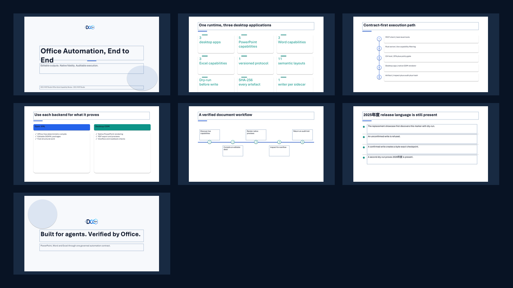
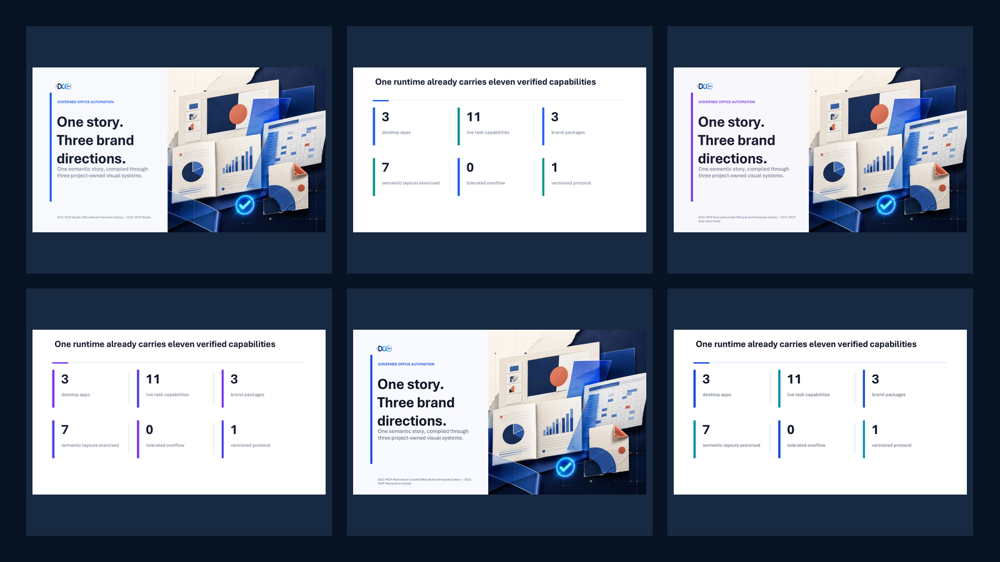
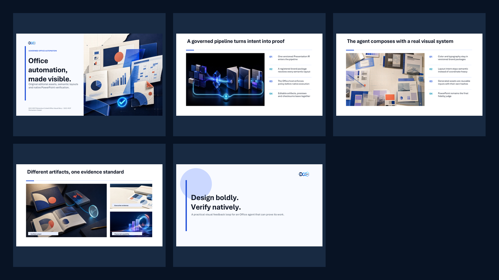
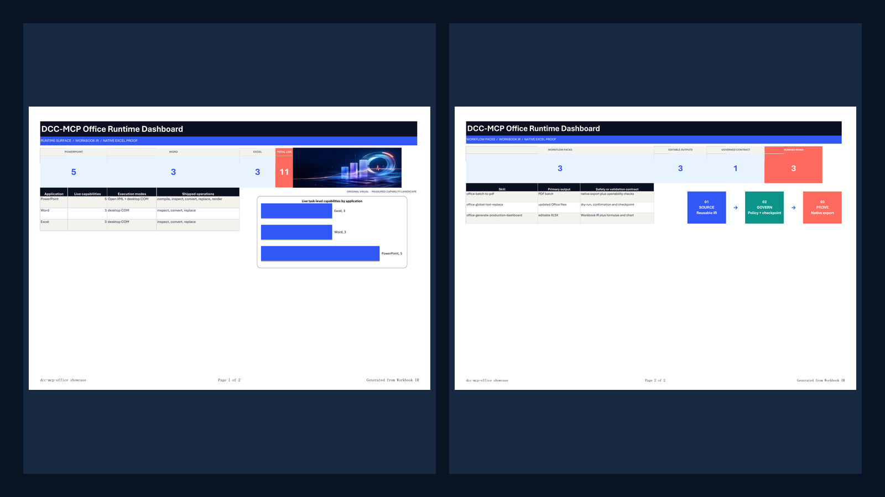
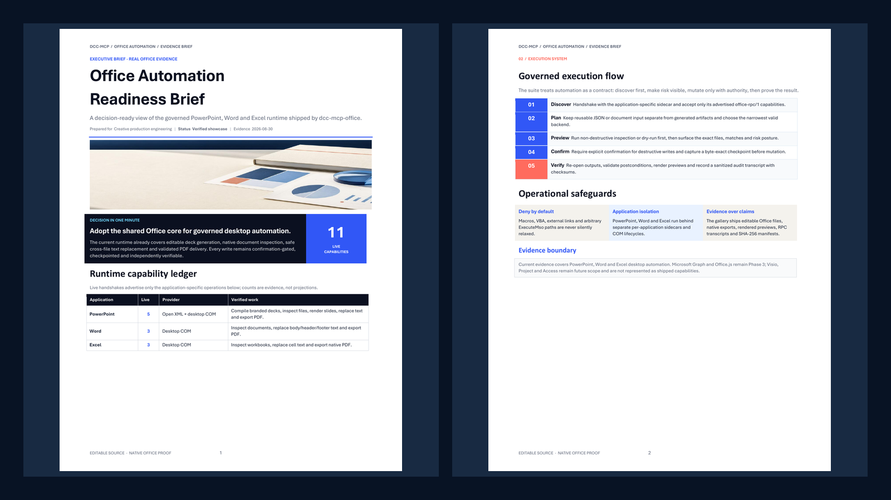
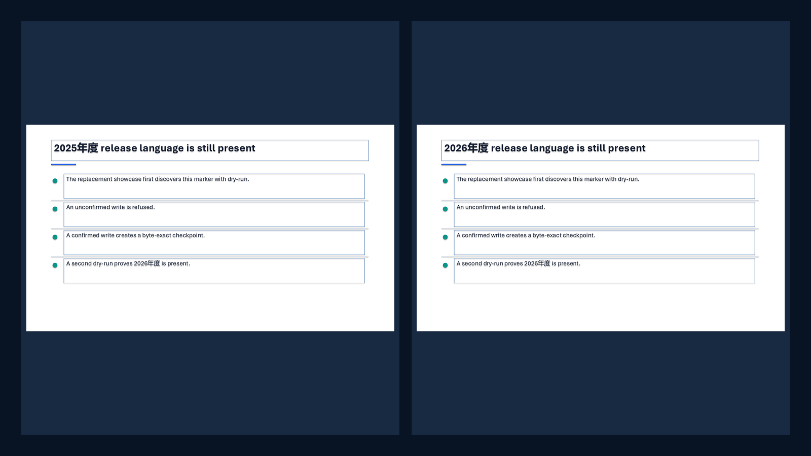
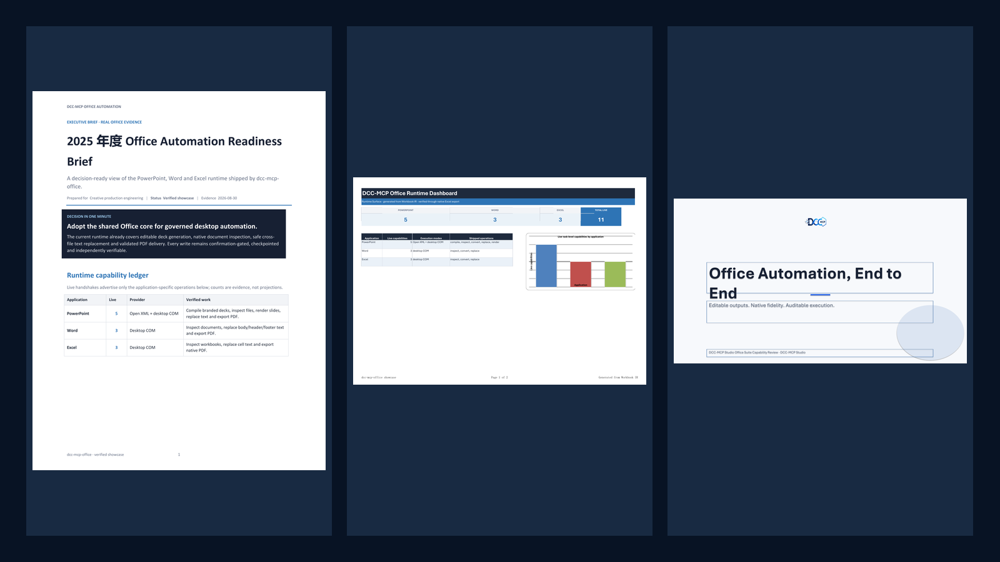

# dcc-mcp-office showcase gallery

This gallery is executable evidence, not a roadmap collage. Every demo pairs
its reusable input with editable Office artifacts, a real preview, structured
Host/MCP evidence, verification notes and SHA-256 checksums.

| Demo | What it proves | Preview | Editable / native artifacts | Evidence |
|---|---|---|---|---|
| [Template-first deck pipeline](./deck-pipeline/) | Presentation IR → external `brand://` template → editable PPTX → native slide previews → overflow report |  | [PPTX](./deck-pipeline/dcc-mcp-office-suite.pptx) · [input IR](./deck-pipeline/input.json) | [metadata](./deck-pipeline/metadata.json) · [RPC transcript](./deck-pipeline/transcript.json) |
| [Brand template comparison](./template-gallery/) | One Presentation IR → three versioned `brand://` packages with Aptos Display/Aptos roles → three editable PPTX files → twelve PowerPoint renders → deterministic quality gates |  | [PPTX variants](./template-gallery/artifacts/) · [input IR](./template-gallery/input.json) · [quality report](./template-gallery/quality-report.json) | [metadata](./template-gallery/metadata.json) · [RPC transcript](./template-gallery/transcript.json) |
| [Image-rich semantic layouts](./image-rich-deck/) | Six original editorial visuals → image-led cover + `image_left_text_right` + asymmetric `image_grid` → editable PPTX media → native PowerPoint renders |  | [PPTX](./image-rich-deck/dcc-mcp-office-visual-story.pptx) · [input IR](./image-rich-deck/input.json) · [source assets](./image-rich-deck/assets/) · [generation manifest](./image-rich-deck/asset-manifest.json) | [metadata](./image-rich-deck/metadata.json) · [RPC transcript](./image-rich-deck/transcript.json) |
| [Production capability dashboard](./production-dashboard/) | Workbook IR → image-led KPI system + native capability chart + editable workflow rail → XLSX → native Excel PDF preview |  | [XLSX](./production-dashboard/showcase-dcc-mcp-office-runtime-dashboard.xlsx) · [input IR](./production-dashboard/input.json) | [metadata](./production-dashboard/metadata.json) · [RPC transcript](./production-dashboard/transcript.json) |
| [Executive Word brief](./word-executive-brief/) | Structured content + original editorial banner → Aptos editorial hierarchy → editable DOCX → Word inspection → native PDF → all-page visual review |  | [DOCX](./word-executive-brief/dcc-mcp-office-executive-brief.docx) · [PDF](./word-executive-brief/pdf/dcc-mcp-office-executive-brief.pdf) · [content](./word-executive-brief/content.json) | [metadata](./word-executive-brief/metadata.json) · [RPC transcript](./word-executive-brief/transcript.json) |
| [Safe global text replacement](./global-text-replace/) | PowerPoint + Word + Excel dry-run → confirmation gate → byte-exact checkpoints → verified commit |  | [before](./global-text-replace/before/) · [after](./global-text-replace/after/) · [checkpoints](./global-text-replace/checkpoints/) | [metadata](./global-text-replace/metadata.json) · [RPC transcript](./global-text-replace/transcript.json) |
| [Mixed Office batch to PDF](./batch-to-pdf/) | Isolated PowerPoint, Word and Excel COM sidecars → one validated PDF batch |  | [Office inputs](./batch-to-pdf/inputs/) · [PDF outputs](./batch-to-pdf/artifacts/) | [metadata](./batch-to-pdf/metadata.json) · [RPC transcript](./batch-to-pdf/transcript.json) |

## Reproduce

The complete capture requires Windows in an interactive user session with
PowerPoint, Word and Excel installed. The checked-in artifacts were generated
with the repository's Host, not by a second renderer.

```powershell
vx run build
$env:PATH = "<poppler-bin>;$env:PATH"
python scripts/capture_showcases.py --with-office --force
python scripts/validate_showcases.py
```

Without desktop Office, run `vx run self-test` to exercise the deterministic
Presentation IR → Open XML → inspect round-trip. Hosted CI validates the
checked-in gallery, but does not claim that it ran the real-Office COM lane.

## Evidence contract

- `input.json` is the reusable structured source.
- The Office file or PDF is the downloadable native artifact.
- `preview.png` is composed only from real slide/page renders.
- `quality-report.json` separates deterministic layout gates from future learned or human aesthetic preference.
- `transcript.json` records sanitized `office-rpc/1` requests, results, jobs,
  notifications and audit posture; local absolute paths are removed.
- `metadata.json` records capabilities, backends, verification notes,
  reproduction commands and SHA-256 checksums.
- Each committed file is under 3 MB; each gallery preview is exactly 1600×900.
